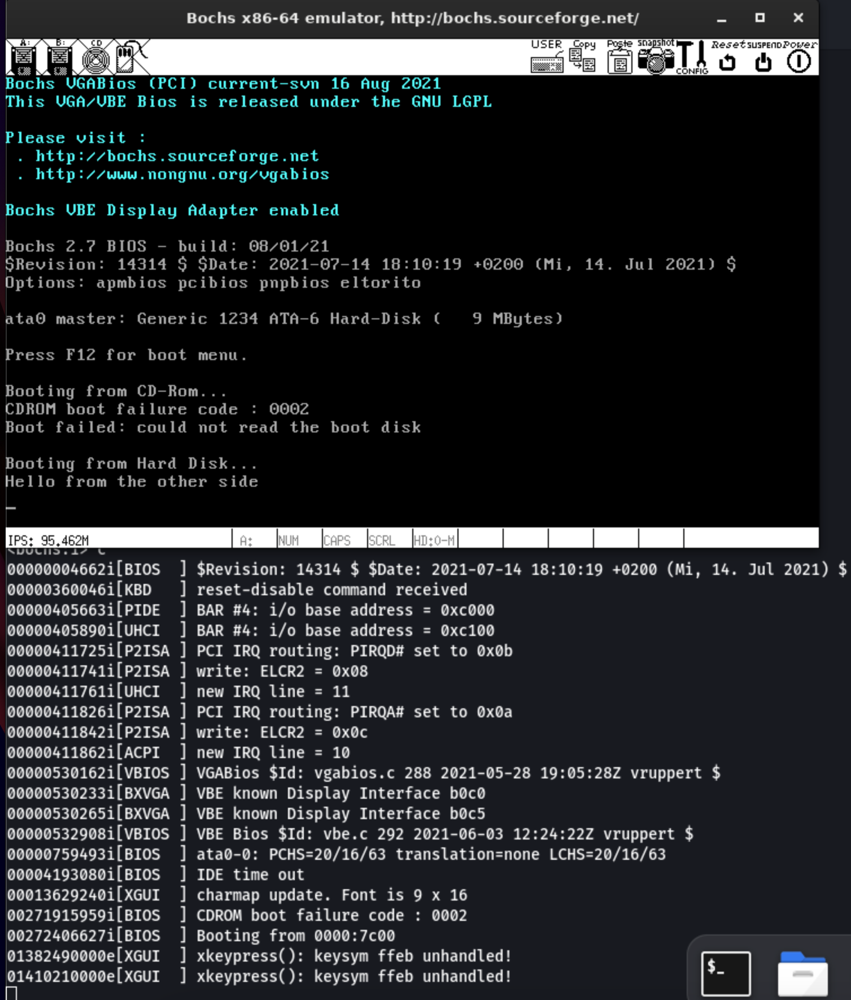

# Bootkit debugging with Bochs

## Necessary packages for using Bochs:

```bash
sudo apt install bochs bximage bochsbios vgabios
##Installs the Bochs IA-32 emulator, bximage (image creation utiltiy) and
## BIOS and VGA BIOS software for Bochs emulator
sudo apt install libgtk2.0-dev bochs-x
##additional libraries for running on aarch64 Linux machine
```


## Using bximage to create a target hard disk image for debugging/dynamic analysis:

```bash
========================================================================
                                bximage
  Disk Image Creation / Conversion / Resize and Commit Tool for Bochs
         $Id: bximage.cc 14091 2021-01-30 17:37:42Z sshwarts $
========================================================================

1. Create new floppy or hard disk image
2. Convert hard disk image to other format (mode)
3. Resize hard disk image
4. Commit 'undoable' redolog to base image
5. Disk image info

0. Quit

Please choose one [0] 1

Create image

Do you want to create a floppy disk image or a hard disk image?
Please type hd or fd. [hd] hd

What kind of image should I create?
Please type flat, sparse, growing, vpc or vmware4. [flat] flat

Choose the size of hard disk sectors.
Please type 512, 1024 or 4096. [512] 512

Enter the hard disk size in megabytes, between 10 and 8257535
[10] 128

What should be the name of the image?
[c.img] msdos_rip.img

Creating hard disk image 'msdos_rip.img' with CHS=260/16/63 (sector size = 512)

The following line should appear in your bochsrc:
  ata0-master: type=disk, path="msdos_rip.img", mode=flat
```

Now that we have a test image to work with, let's proceed with setting up our Bochs configuration file.


## Bochs configuration file (bochsrc.bxrc) initial setup:

```bash
megs: 512 ##This has to match the size of the image you created; it will be changed to 128 for this test image
romimage: file="/usr/share/bochs/BIOS-bochs-latest"
vgaromimage: file="/usr/share/bochs/VGABIOS-lgpl-latest"
boot: floppy, disk #Has to match the images you provide. If you provide a disk image without an MBR, and set this value to disk, bochs will cry.
ata0-master: type=disk, path="{name-of-disk-image-you-created.img}", mode=flat
mouse: enabled=0
cpu: ips=90000000
```

In your bochsrc.bxrc file, replace the value of the file parameter for the romimage and vgaromimage with the paths of the Bochs BIOS and VGABIOS files respectively, as they appear on your own machine

**

If you are planning to infect the disk image directly with the [infect_mbr_reanimator.py Python script](https://github.com/ic3qu33n/michelangelo-reanimator/blob/52a9811f64482941f89b51424b2d0f69c4ec7414/infect_mbr_reanimator.py) Python script, then you can launch bochs with the above config file using the command:

```bash
bochs -f bochsrc.bxrc
```

[The -f flag specifies the path of the Bochs configuration file to be used when launching Bochs]

Otherwise, if you would like to install an OS to the disk image you’ve created, proceed as follows:

1. Download the latest FreeDOS zip files from the FreeDOS downloads page
2. Unzip the archive containing the floppy disk images, which follows the convention FD{version_number}-FloppyEdition.zip
The result of this is shown in the code snippet below:

```bash
unzip FD13-FloppyEdition.zip 
Archive:  FD13-FloppyEdition.zip
   creating: 120m/
  inflating: 120m/x86BOOT.img        
  inflating: 120m/x86DSK01.img       
  inflating: 120m/x86DSK02.img       
  inflating: 120m/x86DSK03.img       
  inflating: 120m/x86DSK04.img       
  inflating: 120m/x86DSK05.img       
  inflating: 120m/x86DSK06.img       
   creating: 144m/
  inflating: 144m/x86BOOT.img        
  inflating: 144m/x86DSK01.img       
  inflating: 144m/x86DSK02.img       
  inflating: 144m/x86DSK03.img       
  inflating: 144m/x86DSK04.img       
  inflating: 144m/x86DSK05.img       
   creating: 720k/
  inflating: 720k/x86BOOT.img        
  inflating: 720k/x86DSK01.img       
  inflating: 720k/x86DSK02.img       
  inflating: 720k/x86DSK03.img       
  inflating: 720k/x86DSK04.img       
  inflating: 720k/x86DSK05.img       
  inflating: 720k/x86DSK06.img       
  inflating: 720k/x86DSK07.img       
  inflating: 720k/x86DSK08.img       
  inflating: 720k/x86DSK09.img       
  inflating: 720k/x86DSK10.img       
  inflating: readme.txt
```

1. Copy the desired floppy disk image to your Bochs working directory:

```bash
cp ~/freedos/144m/x86BOOT.img ~/{b00tkit_testing_dir}/FD13floppy144_x86Boot.img
```

1. Make the following changes to the bochsrc.bxrc file during the FreeDOS installation process:

```bash
megs: 512
romimage: file="/usr/share/bochs/BIOS-bochs-latest"
vgaromimage: file="/usr/share/bochs/VGABIOS-lgpl-latest"
floppya: 1_44="FD13floppy144_x86Boot.img", status=inserted
boot: floppy,disk
ata0-master: type=disk, path="msdos_rip.img", mode=flat
mouse: enabled=0
cpu: ips=90000000
```


##Final bochs configuration file
Here is a final working bochsrc.bxrc for testing our test image we created earlier:

```bash
megs: 128
romimage: file="/usr/share/bochs/BIOS-bochs-legacy"
vgaromimage: file="/usr/share/bochs/VGABIOS-lgpl-latest"

boot: cdrom, disk
floppy_bootsig_check: disabled=0
ata0: enabled=1, ioaddr1=0x1f0, ioaddr2=0x3f0, irq=14
ata0-master: type=disk, path="new-dos-rip.img", mode=flat, translation=auto
ata1: enabled=1, ioaddr1=0x170, ioaddr2=0x370, irq=15
ata2: enabled=0
ata3: enabled=0

#config_interface=textconfig

info: action=report
error: action=report
panic: action=report

mouse: enabled=0
display_library: x
vga: extension=vbe

cpu: ips=90000000
```

***

### Resources

See the following resources for additional details on this process:

“How to make a simple disk image”

Bochs Documentation

[How to make a simple disk image](https://bochs.sourceforge.io/doc/docbook/user/diskimagehowto.html)

***
Test a disk image with bochs using the following command: 

```bash
bochs -q -f bochsrc.bxrc
```

And voilà, the results of running Bochs with a test (vaguely troll-ish) MBR


